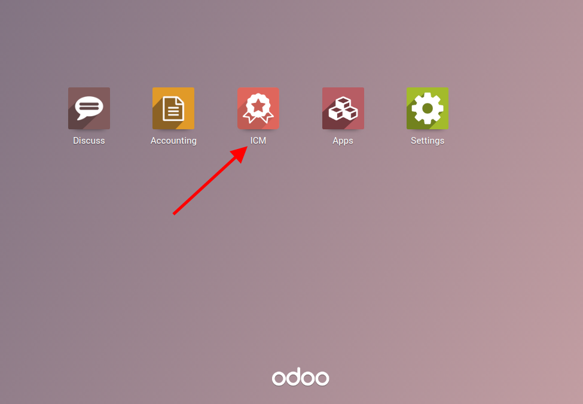
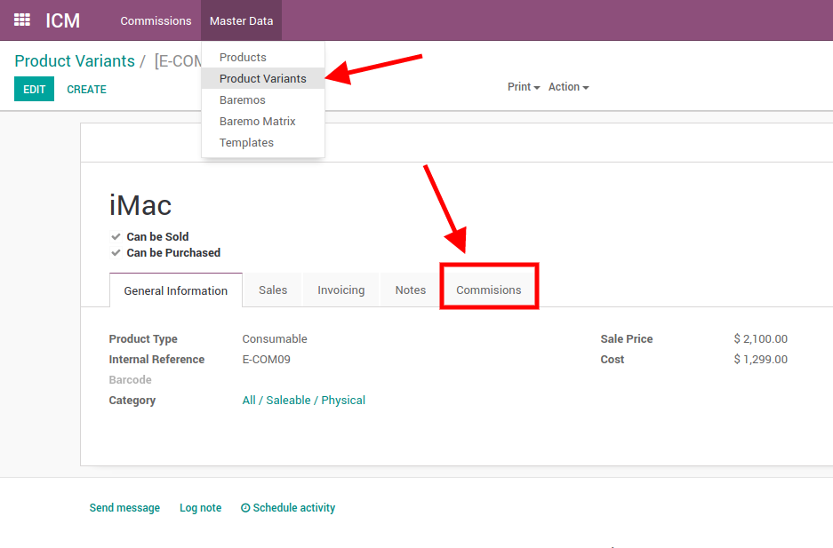
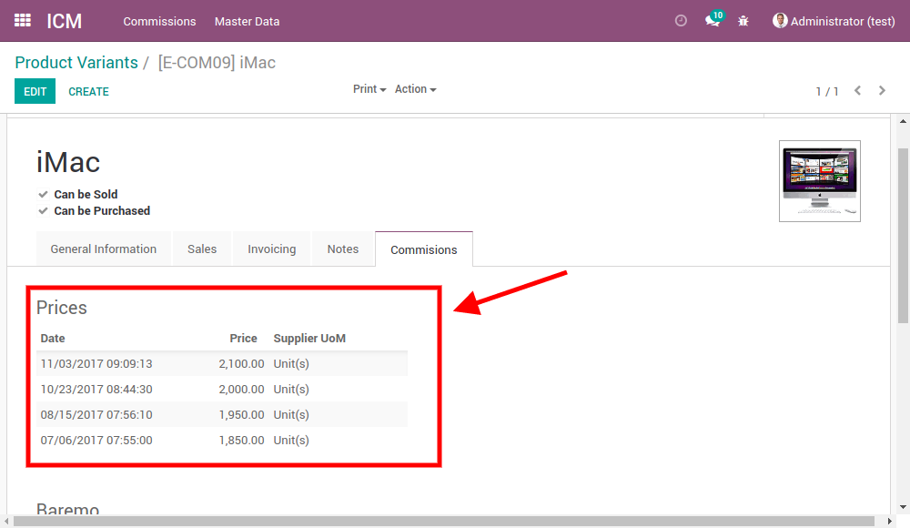
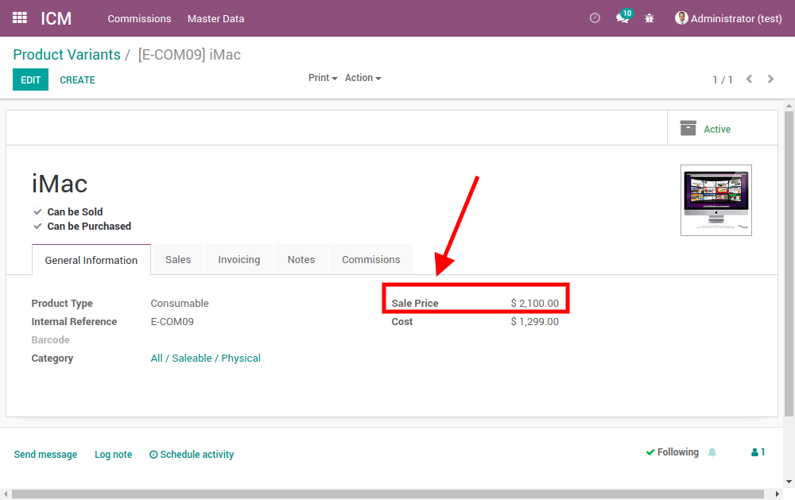
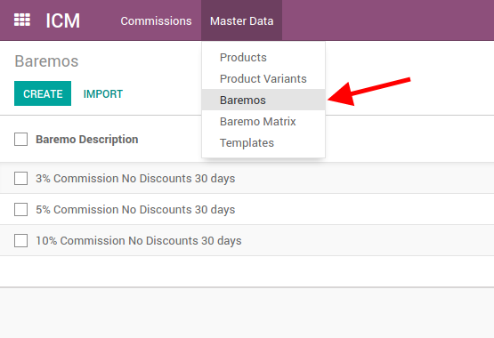
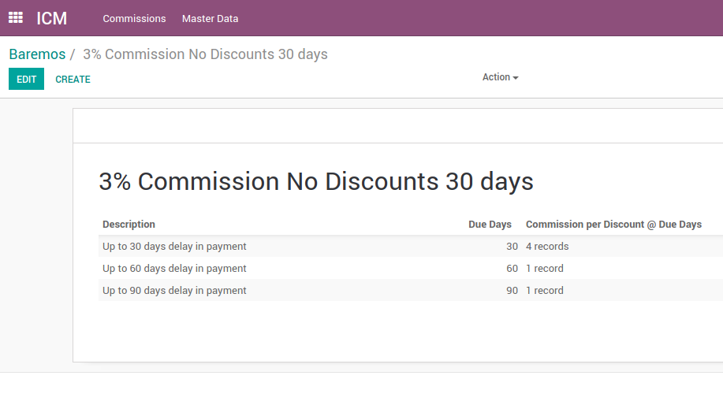
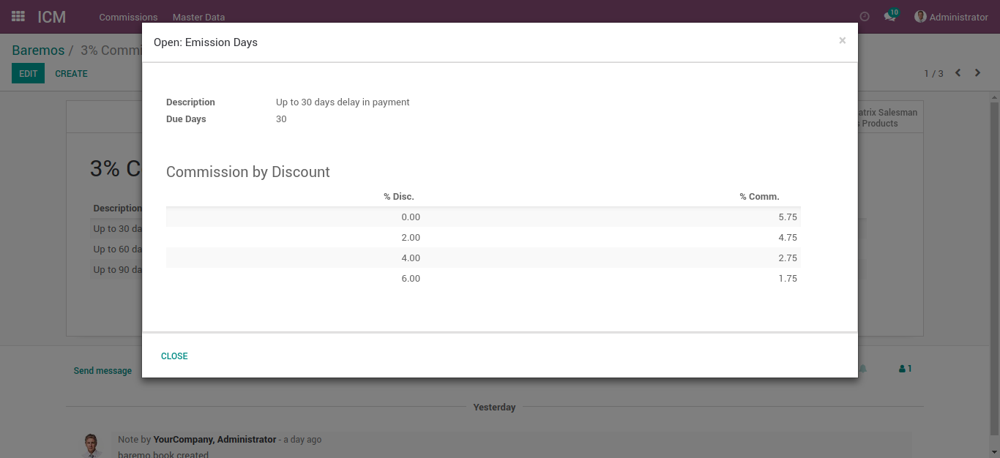
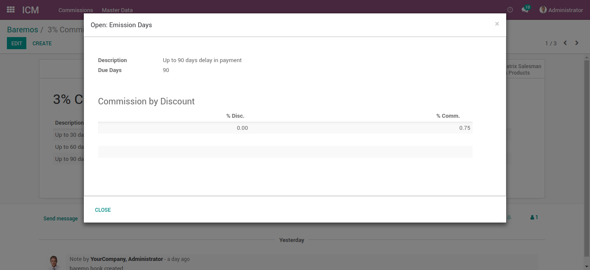

Administración de compensación por incentivos
=============================================

Introducción
------------

Te permite gestionar el proceso asociado al cálculo de incentivos 
y comisiones para los vendedores de una compañía. 



Configuración
-------------

1. Precio lista
```````````````

ICM -> Datos Maestros -> Variantes de producto -> (Escoger un producto)



Para el cálculo de las comisiones por producto (por línea de factura) se 
consulta el precio lista del producto. Hay dos sitios desde donde 
se puede consultar.

El primero es en la tabla del histórico de precios lista 
(debe ser usuario manager con permisos de características técnicas,
para poder ver la pestaña de comisiones en la variante del producto).
Dependiendo de la fecha de emisión de la factura 
se tomará el precio de venta vigente.



**Ejemplo:**

+-------------------------+--------------+------------------+
|          Fecha          |     Price    | UdM de proveedor |
+=========================+==============+==================+
|   Mes/Dia/Año 00:00:00  |       X      |                  |
+-------------------------+--------------+------------------+
|   11/03/2017 09:05:00   |   2100.00    |     Unidad(es)   |
+-------------------------+--------------+------------------+
|   10/23/2017 08:44:00   |   2000.00    |     Unidad(es)   |
+-------------------------+--------------+------------------+
|   08/15/2017 07:56:10   |   1950.00    |     Unidad(es)   |
+-------------------------+--------------+------------------+
|   07/06/2017 07:55:00   |   1850.00    |     Unidad(es)   |
+-------------------------+--------------+------------------+

Si tenemos una factura donde la fecha de emisión sea el 09/17/2017, 
entonces se tomará el precio 1950.00 como precio lista. El segundo, 
en caso de que no exista histórico de precios, entonces se tomará 
el precio lista directo del campo de precio de venta del producto.



2. Baremo
`````````

ICM -> Datos Maestros -> Baremos



En el baremo podemos configurar el porcentaje de comisión sobre
la venta que será pagado al vendedor. Este cálculo depende de que tan
rápido paga el cliente y si se hace descuento sobre la venta, es por eso 
que en el baremo podremos configurar el porcentaje exacto de 
comisión dependiendo de la fecha de emisión o de vencimiento de la 
factura y la fecha de pago del cliente. En los casos más comunes, 
mientras más rápido pague el cliente, más comisión obtiene el vendedor.

-------



+------------------------------------------------+--------------+--------------------------+
|               Description                      |   Due Days   | Comisiones por descuento |
+================================================+==============+==========================+
| Paga antes de los 30 días                      |      30      |      4 registros         |
+------------------------------------------------+--------------+--------------------------+
| Paga después de 30 días y antes de 60 días     |      60      |      1 registro          |
+------------------------------------------------+--------------+--------------------------+
| Paga después de 60 días y antes de 90 días     |      90      |      1 registro          |
+------------------------------------------------+--------------+--------------------------+

-------



+----------------------------------+--------------------------------+
|   Comisiones por descuento cuando se 'Paga antes de los 30 días'  |
+===============================+===================================+
|             % Disc            |             % Comm.               |
+-------------------------------+-----------------------------------+
|              0.00             |              5.75                 |
+-------------------------------+-----------------------------------+
|              2.00             |              4.75                 |
+-------------------------------+-----------------------------------+
|              4.00             |              2.75                 |
+-------------------------------+-----------------------------------+
|              6.00             |              1.75                 |
+-------------------------------+-----------------------------------+

-------


+------------------------------------------+-----------------------------------------+
|   Comisiones por descuento cuando se 'Paga después de 30 días y antes de 60 días'  |
+==========================================+=========================================+
|                  % Disc                  |                % Comm.                  |
+------------------------------------------+-----------------------------------------+
|                    0.00                  |                  1.50                   |
+------------------------------------------+-----------------------------------------+

-------



+------------------------------------------+-----------------------------------------+
|   Comisiones por descuento cuando se 'Paga después de 60 días y antes de 90 días'  |
+==========================================+=========================================+
|                  % Disc                  |                % Comm.                  |
+------------------------------------------+-----------------------------------------+
|                    0.00                  |                  0.75                   |
+------------------------------------------+-----------------------------------------+

Si tenemos una factura donde se vende una computadora y el precio unitario 
es de 2000$, y el precio lista es de 2100$.

Significa que hubo un descuento del 4,76%. También debemos tomar en cuenta
la velocidad de pago del cliente, en nuestro caso, diremos que pagó el mismo
día, lo que significa que pagó antes de los 30 días y que corresponde
al primero caso del baremo. Ahora tenemos que revisar en la
tabla de comisiones por descuento cuando se paga antes de los 30 días.
El descuento queda entre 4 <= 4,76% < 6, y se escoge el descuento que esté
por encima, lo que signifca que la comisión del vendedor será de un 1,75%
sobre el precio unitario, 2000$ x 0,015 = 35$ de comisión.

Esto sucede cuando las comisiones se hacen por producto, y por eso se toma
en cuenta el precio lista del producto `1. Precio lista`_.

Si las comisiones se calculan por pagos a la factura y no por productos, 
entonces, no existiría descuento, y se tomaría la comisión por 
descuento de 0%, lo que sería un 5.75% de comisión sobre el total del pago.
2000$ x 0,0575 = 115$ de comisión para el vendedor.

<Video aquí con demostración>

3. Matriz de baremo
```````````````````

ICM -> Datos Maestros -> Matriz de baremo

La matriz de baremo corresponde a una configuración específica por baremo, 
product y/o vendedor.

Por ejemplo, para el baremo de 3% a 30 días, podemos configurar que cuando el
vendedor Demo User venda el producto iPad Mini, siempre se le aplicará ese 
baremo y no el que esté configurado en el documento de comisión.

En caso de no especificar vendedor, entonces cada vez que alguien venda
un iPad Mini, sera aplicado el baremo de 3% a 30 días sin importar quien
haya sido el vendedor.

4. Plantilla
````````````

Se trata del documento donde configuramos como será el cálculo de las
comisiones. Existen varios campos en la plantilla, por lo cual vamos a 
explicarlos uno por uno.

**Fecha de inicio de la política**:

Será la fecha a partir de la cual se empezará a contar los días para saber en
que rango entrará en el baremo y que comisión se aplicará al vendedor.

- Fecha de emisión de la factura: a partir de la fecha de emisión de la 
  factura se empieza a contar los días que tiene el cliente para pagar

- Fecha de vencimiento de la factura: a partir de la fecha de vencimiento de la 
  factura se empieza a contar los días que tiene el cliente para pagar

**Fecha de fin de la política**:

Es la fecha en la cual se considera que el cliente pagó la factura.

- Último pago en la factura: La fecha del último pago de la factura es la
  que se tomará en cuenta como la fecha de pago total de la factura.

- Fecha del pago: La comisión será determinada por la fecha de cada pago,
  es decir, si hubo diferentes fechas en los pagos parciales y coinciden con
  diferentes comisiones, entonces, la comisión será determinada haciendo
  cálculos por partes.


**Política de baremo**: Es el campo donde se especifica el baremo que se usará
para el cálculo de las comisiones.

- Compañía: se utilizará el baremo configurado en la compañía.
- Cliente: se utilizará el baremo configurado para el cliente, el cual puede
  estar en la factura o en la línea del asiento contable.
- Entidad comercial: Obtiene el baremo del partner comercial del cliente.
- Vendedor: User el baremo configurado para el vendedor.
- Matriz de baremo: Usa el baremo donde se encuentre una matriz de baremo 
  del producto y del vendedor, en caso de no existir, se usa el baremo 
  configurado en el documento de la comisión.
- Documento: Usar el baremo especificado en el documento de la comisión.

**Basado en**:

- Pagos parciales: Las comisiones serán pagadas basandose en los pagos 
  parciales, es decir, no es necesario que una factura esté totalmente pagada
  para calcular comisión.
- Facturas completamente pagadas: Las comisiones se calculan basandose en
  las facturas que estén totalmente pagadas.

**Política de vendedor**: 

- Factura: Toma como vendedor al que se encuentra en la factura
- Cliente: Toma como vendedor al vendedor configurado en el 
  cliente de la factura
- Entidad comercial: Toma como vendedor al vendedor configurado en la entidad
  comercial del cliente de la factura.

**Calculado sobre o Alcance**: 

- Factura completa: Las comisiones son calculadas sobre el subtotal de la
  factura, ya que, en cálculo de comisiones no se incluyen impuestos.
- Productos facturados: La comisión es calculada sobre cada línea de la 
  factura. Para esta opción se debe tener configurado la matriz de baremo
  por cada producto, sino, tomará el baremopor defecto en el documento de 
  la comisión.

**Baremo por defecto**:

En caso de que no se encuentre un baremo configurado dependiendo de la 
política escogida, entonces se usara el baremo por defecto configurado
en la plantilla.

Crear una plantilla
```````````````````

`Crear una plantilla <https://youtu.be/N2zyLkdii64>`_.

Usar la plantilla en una comisión
`````````````````````````````````

`Usar plantilla <https://youtu.be/jW4NGtjT6ys>`_.

Calcular comisión a un vendedor
-------------------------------

**Vendedores**: Se calcularan las comisiones de todos los vendedores
seleccionados.


Ejemplos de uso
---------------

`Ejemplo de comisiones 1/3 <https://youtu.be/WkU3549AwbI>`_.
`Ejemplo de comisiones 2/3 <https://youtu.be/8yc1ZIYu8j4>`_.


